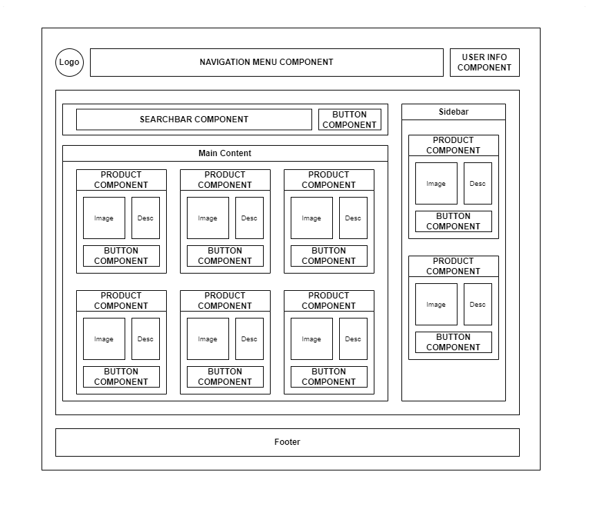
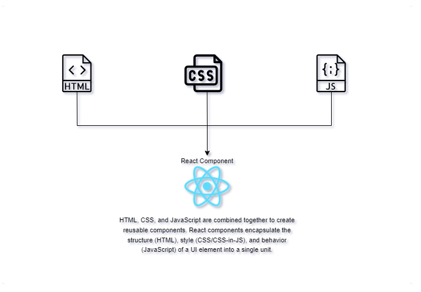

# React Basics

### What is React?

React is a javascript library for building user interfaces.

We know that HTML & CSS are used to build user interfaces. And Javascript is used to make the user interfaces interactive.

React makes building complex, interactive and reactive user interfaces much simpler using one core concept...

To acheive that, to make _"building complex, interactive and reactive user interfaces simpler"_, React embraces the concept called **"Components"**.

### Components

_What exactly is a Component?_

Components are the building blocks that make up the user interface. So, basically _individual parts of the UI_.

Below is an example of a page composed of components as building blocks. You can see that there is a ```Navigation Menu```, ```User Info```, ```Search Bar```, ```Product``` and ```Button``` components. You can also see that some of the components are repeating like the Product and Button component, that demonstrates the reusability of it.



Component is simply just a combination of HTML & CSS for styling. And JavaScript for some logic/behavior. They are combined together into a single unit of code to do one task.



### So, what is JSX?

JSX is the HTML code inside the component.

```javascript
function MyComponent() {
  return (
    // Start of JSX here...
    <div>
      <h2>Hello World!</h2>
    </div>
    // End of JSX code here...
  );
}
export default MyComponent;
```

_But wait!_ It is not really HTML. It looks like HTML, but it is a special JSX syntax invented by the creators of React. But in the background, it's still JavaScript code. To explain this, go to "How React Works" section.

### Why Components?

##### :arrows_counterclockwise: Reusability

Having reusable building blocks help us avoid repetition. Programming in general, it is good if we don't repeat ourselves.

##### :left_right_arrow: Separation of Concerns

Having a separation of concern helps us with keeping our code base small, manageable and easy to maintain instead of having one large file which holds all the HTML code. Basically, don't do too many things in one and same place (function). So, we can split big chunks of code into multiple smaller functions.

### The Directory Structure

We will be focusing on the ```src/``` directory at this point since all of the code we will be working on are inside this folder.

```
root
│ ├── public/
│ │   ├── index.html
│ │   ├── manifest.json
│ │   └── index.js
│ └── src/
│     ├── App.js
│     ├── index.css
│     └── index.js
│
├── .gitignore
├── package-lock.json
└── package.json
```

<details>
<summary>src/index.js</summary>

<br />

_This is the code file that is first executed whenever the landing page loads. It holds the code that executed initially. But that code inside is not exactly what you will see when delivered to the browser. But what you will see is the transformed version or the compiled code generated by React from that. The idea of this is that, we can write code in a nice way, to simplify it. Make it easy to understand. We write few lines of simple, and small snippets of code and then we have the code in the end which runs in all browsers._

```javascript
import ReactDOM from 'react-dom/client';

import './index.css';
import App from './App';

const root = ReactDOM.createRoot(document.getElementById('root'));
root.render(<App />);
```

* ```const root = ReactDOM.createRoot()``` :  This creates the main entry point of the overall user interface you are about to build with React. That's the idea behind createRoot() hook, and what this does is it tells React where this React application (the user interface), should be placed in the web page that is loaded.
* ```document.getElementById('root')``` : This argument inside createRoot() function retrieves an HTML element with the id of 'root' from DOM. Once retrieved, react components will be set to be rendered here. This is typically a div or another DOM element in your HTML document.
* ```root.render()``` : Renders the component specified inside its argument.
* ```<App />``` : This argument inside root.render() function is the main/root component in the Component tree. This will return a JSX code that will then be rendered to the root DOM element and bring onto the user's screen or the User Interface.

</details>

<details>
<summary>public/index.html</summary>

<br />

_The ```index.html``` file inside public directory which is loaded by the browser is basically the only HTML file that is being used by overall React application. Because it's a so-called single page application, so it has a single HTML file. This is the place where the React-driven user interfaces are rendered into._

```html
<!DOCTYPE html>
<html lang="en">
  <head>
    <meta charset="utf-8" />
    <link rel="icon" href="%PUBLIC_URL%/favicon.ico" />
    <meta name="viewport" content="width=device-width, initial-scale=1" />
    <meta name="theme-color" content="#000000" />
    <meta
      name="description"
      content="Web site created using create-react-app"
    />
    <link rel="apple-touch-icon" href="%PUBLIC_URL%/logo192.png" />
    <link rel="manifest" href="%PUBLIC_URL%/manifest.json" />
    <title>React App</title>
  </head>
  <body>
    <noscript>You need to enable JavaScript to run this app.</noscript>
    <!-- This root div  is the entry point of all components that we created. -->
    <div id="root"></div>
  </body>
</html>
```
* ```<div id="root"></div>``` : The empty div with the id of ```root``` is the DOM element that we are going to attach/inject our React-driven user interface. Or simply, _Components_.
<br />

  If you take a look at index.js file, do you remember, there's a line ```ReactDOM.createRoot(document.getElementById('root'))```. Basically, what it does is telling React that this should be the root of our React application, the main DOM element where the React-driven user interface gets rendered into. All the interactive user interfaces that we created will be put here.
</details>

<details>
<summary>src/App.js</summary>

<br />

_The App.js file is the main component of this ReactJS application._

```javascript
function App() {
  return (
    <div>
      <h2>Let's get started!</h2>
    </div>
  );
}
export default App;
```

_And what it does is basically return that HTML elements wrapped around return() statement. See code below:_

```html
<div>
  <h2>Let's get started!</h2>
</div>
```

This basic block of code above is called  _JavaScript Syntax Extension_ or **JSX**.

</details>

### How React Works

To explain how React works, let's first discuss about the programming paradigm its using.

There are 2 types of programming paradigm:

1) ```Declarative approach``` : Declarative approach is a type of programming paradigm where you simply describe what you want to acheive. In this case with React, you describe how your User Interface should look. And React takes care of everything in the background like updating the DOM to match that description.

2) ```Imperative approach``` : Explicitly specifying the step-by-step instructions of the code for acheiving it. Where you provide explicit instructions on how to manipulate the DOM or update the user interface in response to changes in data or user interactions.

:clipboard: _React Code built In A 'Declarative Way'_

| Declarative | Imperative |
| ------------- | ------------- |
| <pre>function App() {&#13;&nbsp;return (&#13;&nbsp;&nbsp;&nbsp;&nbsp;&nbsp;&nbsp;<div\>&#13;&nbsp;&nbsp;&nbsp;&nbsp;&nbsp;&nbsp;&nbsp;&nbsp;\<h2\>Let's get started!\</h2\> &#13;&nbsp;&nbsp;&nbsp;&nbsp;&nbsp;&nbsp;&nbsp;&nbsp;\<p\>This is another paragraph!\</p\>&#13;&nbsp;&nbsp;&nbsp;&nbsp;&nbsp;&nbsp;\</div\>&#13;&nbsp;);&#13;}</pre>&#13;_Using our existing JSX code, we simply put ```<p>This is another paragraph!</p>``` in the code below the H2 heading. And done! We have a simple paragraph on the screen right away. We can also transfer it anywhere within the JSX and it will update the UI base on where you put it. Its easy and straightforward._ | <pre>// Step 1: Create a new paragraph element&#13;const paragraph = document.createElement('p');&#13;&#13;// Step 2: Create text content &#13;const text = document.createTextNode('This is another paragraph!');&#13;&#13;// Step 3: Append the text to the paragraph element&#13;paragraph.appendChild(text);&#13;&#13;// Step 4: Append the paragraph element to the document body&#13;document.body.appendChild(paragraph);&#13;</pre> _In the code above, you can see there are multiple lines of regular javascript codes just to produce a simple paragraph on the screen. These lines of code works, but it can get cumbersome when complex user interfaces with dozens and hundreds of elements, which also might be changing (some codes are removed and edited) all the time. Having to write all these instructions makes it complicated. Hard to manage and prone to bugs. And would be problematic in the long run._  |

<br />

_The main goal of React is to make building of User Interfaces simpler, efficient & flexible. They acheived that using Components._

Devs only have to write simple and easy to understand codes. And React will take care of everything in the background to transform it into something that the browser can understand.

#### Part 1: Creating UI using JSX
So, let's say we want to print something on the screen. An H2 header that prints _"Hello React!"_. And below this H2 header, is another text _"Welcome to this page!"_. But the text is rendered from a separate component. The component name is Welcome.

First, we create a Welcome component and use it on main App component.

> **Note**
> Component naming convention: Component filename & function name should be the same

```javascript
function Welcome() {
  return (
    <div>
      <p>Welcome to this page!</p>
    </div>
  );
}
export default Welcome;
```

```javascript
import Welcome from './Welcome';

function App() {
  return (
    <div>
      <h2>Hello React!</div>
      <Welcome />
    </div>
  );
}
export default App;
```

<br />

#### Part 2: Behind the scene
Now, that we're done with the JSX. Behind the scene, React then compiles the JSX code and transforms it to another form of code that the browser can understand.

This transformation is done using a core function from React API:
<details>
<summary>React.createElement()</summary>

> **Note**
> ```React.createElement(type, props, ...children)```
>
> _Parameters:_
> 
> ➣ **type**: HTML element string name that you want to create. _i.e_: ```div```, ```p```, ```section```, ```footer```, etc.
> 
> ➣ **props**: The object that configures the element, or props. If there's no props, just put ```{}```
> 
> ➣ **...children**: The HTML element(s) that is contained in your root element. You can have as many nested elements as you want.
>
> More about [```React.createElement()```](https://react.dev/reference/react/createElement).

:information_source: Additional Info:
- The ```...children``` parameter of React.createElement() can also accept a component, not only limited to html elements.
- When you're going to create another element within a container element, that's another nested React.createElement()
</details>

<br />

:green_circle: **Step 1:** React finds the root element in App component. In this case, its a div.

> **Important**
> At the very beginning, React.createElement() is only looking for one main root element. This element will contain all the child elements.
>
> That's why when you see JSX code, they are always wrapped in one container.

<br />

:green_circle: **Step 2:** Remember the JSX of App component in Part 1? Our root element is a div. And wrapped inside it is an \<h2\> element, and a component \<Welcome \/>. So, total of 2 elements.

In the code, we are expecting a structure to have 2 React.createElement() functions inside main React.createElement(). This is how it looks:
```javascript
  return React.createElement(                         // 1) 1st function call: Main React.createElement()
    'div',                                            // 2) Creates a root element <div>
    {},                                               // 3) Root element <div> doesn't receive any props, so put {}.
    React.createElement('h2', {}, "Hello React!"),    // 4) 2nd function call: Creates the first child element <h2> with text content 'Hello React!'. And empty props.
    React.createElement(Welcome, {})                  // 5) 3rd function call: Last child is a Component <Welcome /> without props to receive.
  );                                                  //    (A component is still a function that can be called and returns different output base on given values)
```

Above code is equivalent to JSX code below:
```javascript
return (
  <div>
    <h2>Hello React!</h2>
    <Welcome />
  </div>
);
```